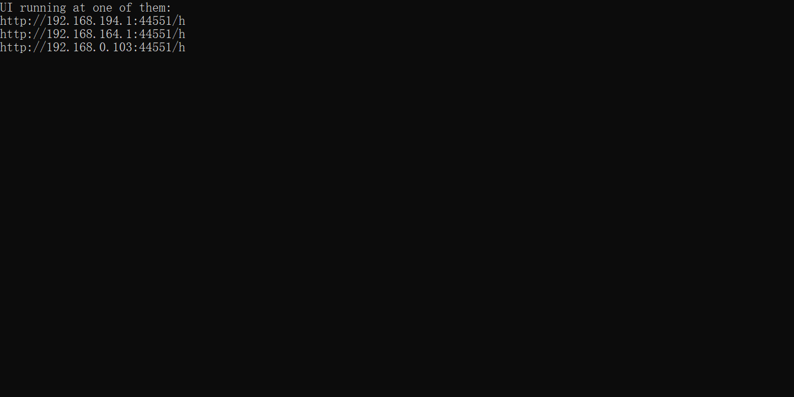
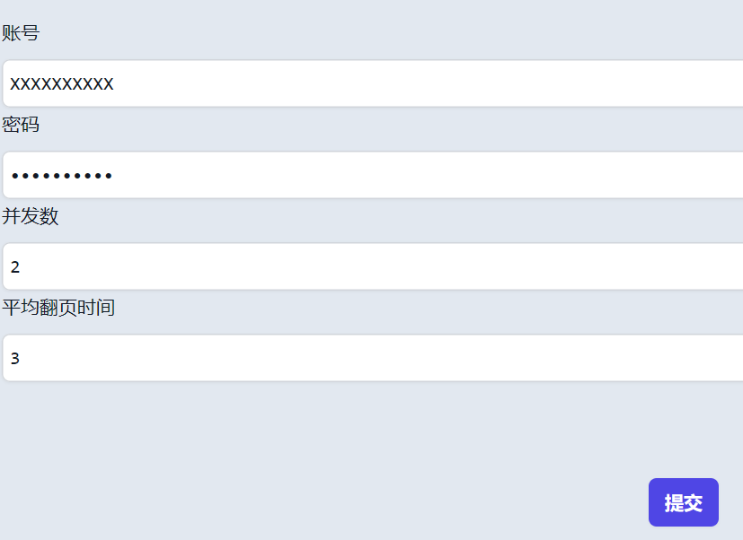

# AUTO JXUFE-LAKE beta

·AUTO JXUFE-LAKE 是一个**简单易用**，**带有 UI**，**支持多端操作**，**支持多用户**，每个用户支持**高并发**，以最快速度帮你解脱浪费时间的读书任务的软件。

·代码开源，不用担心账号泄露等安全问题。

## 使用步骤

 

1.**下载压缩文件**

下载压缩文件后解压，不能修改解压后压缩文件的名字及位置。

2.**运行 autoread.exe 文件**

带黑框框显示文字时，将地址粘贴到浏览器中即可看到 UI。

_同一局域网下的设备均可访问该网址。_

3.**在 UI 中登录账号**

在 UI 中登录您的账号，程序会自动选出您还没完成的任务，然后帮您自动完成！

_并发数最好不要超过 3，平均翻页时间不能低于 2，否则后果自负！_

## Q&A

·UI 显示进度达 100%，但还没完成怎么办？

> 您可以自己登录到官网，然后将未读的书目进度设置成第一页，然后再运行程序。
> 当然，也可能是程序有 bug，不过我没时间测试了

## 免责声明

下载并使用该软件则代表您同意了以下条款：

1.本程序仅仅作为学习技术的实验品，不允许用于谋利。

2.如若产生任何纠纷，与作者无关。

3.作为软件的使用者，应该承担一切由该软件带来的后果。
